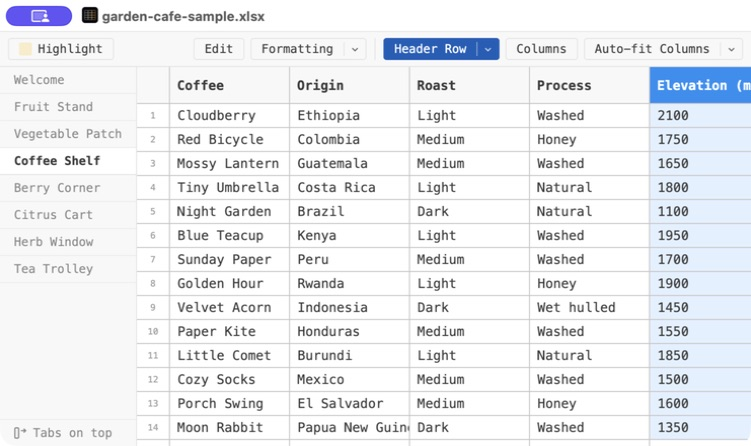
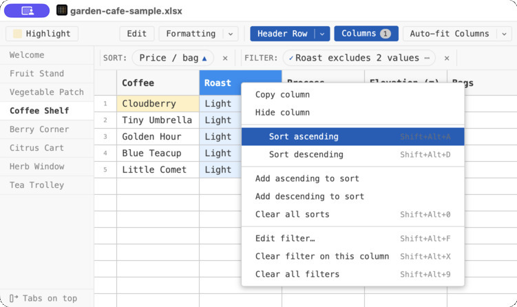
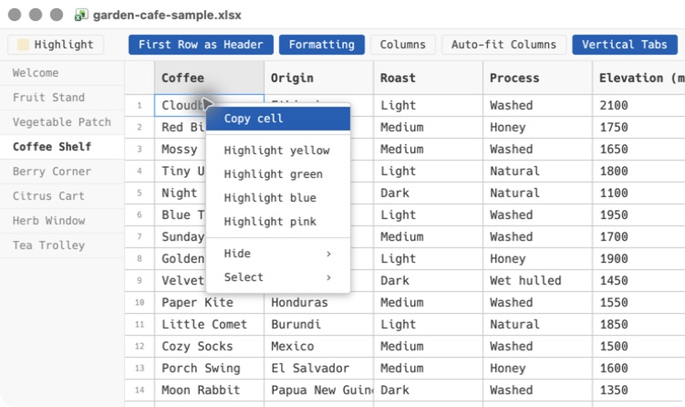
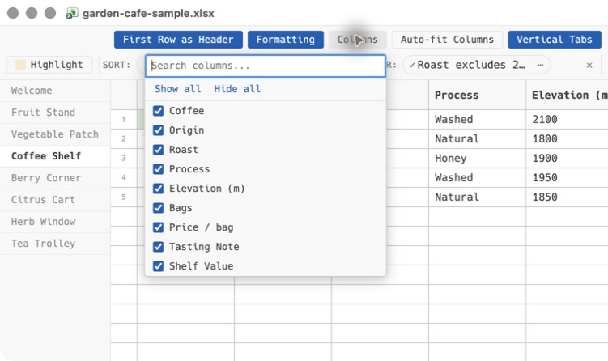

# Desktop app setup and 10-minute try-out

The standalone Table Viewer app opens Excel (`.xlsx` or `.xls`) workbooks as well as comma-separated (`.csv`) and tab-delimited (`.tsv`) files, and remembers how you like to look at them. Sorting, filters, hidden columns, column widths, highlights, the active sheet, and other viewing choices are stored in Table Viewer's own database rather than in the file, so opening a file never changes it. The contents of a cell — the text or numbers inside it — change only when you enter edit mode, change a cell, and save.

You can simply read through the guide—the screenshots show the main flow. If you would like to try it yourself, install Table Viewer and download these two small, cheerful workbooks so you can experiment:

- [Garden Café sample workbook](https://github.com/jbearak/table-viewer/raw/refs/heads/main/docs/examples/garden-cafe-sample.xlsx)
- [Garden Café revised workbook](https://github.com/jbearak/table-viewer/raw/refs/heads/main/docs/examples/garden-cafe-revised.xlsx)

The two files have the same set of sheets and columns, but the revised version changes quantities, prices, and some row positions. That makes them useful for testing whether your view survives a new delivery.

## 1. Install the desktop app

The standalone app currently supports Apple Silicon Macs running macOS 12 or later and x64 or Arm-based PCs running Windows 10 or 11.

### macOS

Install Table Viewer one of two ways:

- **Disk image.** Open the [latest Table Viewer release](https://github.com/jbearak/table-viewer/releases/latest), download `table-viewer-…-arm64.dmg`, open it, and drag **Table Viewer** into your Applications folder.
- **Homebrew.** If you use [Homebrew](https://brew.sh/), run:

  ```sh
  brew install --cask jbearak/table-viewer/table-viewer
  ```

Then open **Table Viewer** from the Applications folder or Spotlight.

### Windows

Open the [latest Table Viewer release](https://github.com/jbearak/table-viewer/releases/latest) and download the file for your computer:

- Choose `table-viewer-…-x64-setup.exe` for most PCs.
- Choose `table-viewer-…-arm64-setup.exe` for an Arm-based PC such as a Snapdragon laptop or Surface Pro X/11.
- If you cannot install software, choose the matching `…-portable.exe` instead. It runs directly with no Start Menu entry and adds per-user **Open with** entries on first launch.

Run the downloaded file. The installer defaults to installing only for your account, which does not require administrator access. Windows builds are unsigned, so SmartScreen may show **Windows protected your PC** the first time. Click **More info**, confirm that the app is Table Viewer, then click **Run anyway**. If you would rather check the download first, each `.exe` on the release page has a matching `.sha256` file; run `Get-FileHash <file>` in PowerShell and compare.

## 2. Open the sample workbook

Download the [sample workbook](https://github.com/jbearak/table-viewer/raw/refs/heads/main/docs/examples/garden-cafe-sample.xlsx). Launch Table Viewer and click **Open File…**, or choose **File → Open…**, then select the downloaded workbook.

You can also right-click a supported file in Finder or File Explorer and choose **Open With → Table Viewer** after installing or launching the app. Table Viewer becomes an available handler without replacing your current default spreadsheet program.

The workbook has a welcome sheet followed by fruit, vegetable, coffee, berry, citrus, herb, and tea sheets. Click **Coffee Shelf** to get oriented.



## 3. Try the main viewing tools

Nothing in this section touches the `.xlsx` file. Sorts, filters, hidden columns, column widths, and highlights are never written into a workbook, even after you have used edit mode — they live in Table Viewer's own database, keyed to the file. That is what lets them survive a new version of the file: regenerate the table from a script, or drop in the copy a colleague sent you, and your arrangement and highlights are still there. Feel free to poke around.

1. Click the orientation button at the end of the worksheet tab strip to move the tabs between the top and left side. With this many sheets, the left side is usually easier to scan. It is also on the tab strip's right-click menu.
2. Click **Auto-fit Columns**, or drag a column border. Double-clicking a column border fits that column to its contents.
3. Right-click a column header to sort or [filter](filtering.md) it. On **Coffee Shelf**, try filtering **Roast** to values containing `Light`, then sort **Price / bag** ascending.
4. Open **Columns** to hide fields you do not need. Try hiding **Origin**; open the menu again to bring it back.
5. Select one or more cells, open **Highlight**, choose a color, and click **Apply to selection**.
6. Click **Formatting** to switch this sheet between its formatted display values and the underlying raw values. **Formatting**, **Header Row** and **Auto-fit Columns** each apply to the current sheet; use the chevron beside them (or right-click) to apply the change to every sheet at once.

Right-clicking a column header is the quickest way to find its sort, filter, copy, and hide actions.



Active sorts and filters appear as controls above the table, where you can edit, disable, reverse, reorder, or remove them.

> [!TIP]
> Most common actions are available in more than one place:
>
> - To highlight quickly, right-click a cell—or right-click anywhere inside a multi-cell selection—and choose **Highlight yellow**, **Highlight green**, **Highlight blue**, or **Highlight pink**.
> - To hide a column without opening **Columns**, right-click its header and choose **Hide column**.
> - To give several adjacent columns the same width, click one column header, then hold **Shift** and click another. Every column between them is selected, inclusive. Drag a border on any selected column to resize them together.





## 4. See the persistence behavior

This is the part Table Viewer is chiefly meant to make less annoying.

1. Make a copy of `garden-cafe-sample.xlsx` and name the copy `garden-cafe-working.xlsx`.
2. Open `garden-cafe-working.xlsx` in Table Viewer.
3. On **Coffee Shelf**, resize a column, hide **Origin**, keep the light-roast filter, select a different sheet-tab arrangement, and highlight a cell.
4. Leave the workbook open in Table Viewer.
5. Make a copy of [the revised workbook](https://github.com/jbearak/table-viewer/raw/refs/heads/main/docs/examples/garden-cafe-revised.xlsx), rename that copy to `garden-cafe-working.xlsx`, and use it to replace the existing working file in the same folder.

Table Viewer should refresh automatically. The data will change, while your compatible viewing choices remain in place. The important detail is that the revised workbook replaces the file at the same path; opening it under a different filename creates a separate saved view.

You can repeat the replacement while keeping the file open—handy when a script in R, Stata, or Python regenerates the same output file.

## 5. A few useful details

- Modern `.xlsx` workbooks have an optional edit mode; legacy `.xls` workbooks are read-only. Edit mode changes only the contents of cells, and only once you save. The app never writes your sorts, filters, widths, hidden columns, or highlights into either format.
- Edit mode also doubles as a place for annotations that outlive a new version of the file. Until you save them, your changes stay as pending edits in Table Viewer's database, so they come back with the file the same way your highlights and layout do.
- View choices are remembered per file and worksheet in the app's local storage. The desktop app and VS Code extension do not currently share saved views.
- Each open file gets its own window. Opening a file that is already open focuses its existing window.
- Sorts and filters follow column names, so Table Viewer may discard them if a revised workbook no longer has a compatible column structure.
- Highlights are positional annotations. They will reappear when temporarily missing rows, columns, or worksheets return, so you do not lose that time and effort.
- CSV and TSV files also open directly in Table Viewer with an optional edit mode. In VS Code, the extension can show a file's raw text beside the grid with synchronized scrolling; that pane is VS Code's own text editor, so it belongs to the extension rather than being something the standalone app lacks.
- Choose **Preferences…** to change the app's appearance, color theme, font, default worksheet-tab orientation, or new-window size. On macOS, Preferences is in the Table Viewer app menu; on Windows, it is in the File menu.

## Troubleshooting

**Windows shows “Windows protected your PC.”** Click **More info**, verify that you downloaded Table Viewer from its GitHub release page, then click **Run anyway**. The Windows build is currently unsigned.

**A workbook opens in another program.** Open Table Viewer first and use **Open File…** or **File → Open…**. Installing Table Viewer makes it available under **Open with**, but deliberately does not replace your existing default spreadsheet program.

**The revised data appears in a separate window or view.** Check that it replaced the working file at exactly the same folder and filename. Saved views are tied to the file path.

**You want to remove Table Viewer.** On macOS, move the application to the Trash, or, if you installed it with Homebrew, run `brew uninstall --cask table-viewer`. On Windows, uninstall it from **Installed apps**. If you chose the portable Windows version, close it and delete the downloaded `.exe`; its per-user **Open with** entries may remain because there is no uninstaller.

## What feedback would be most helpful?

Honest first impressions are ideal. In particular:

- Was installation or opening the first workbook confusing anywhere?
- Which control did you reach for first, and was it where you expected?
- Did the revised-file exercise preserve what you expected it to preserve?
- Did sorting, filtering, column hiding, highlighting, or sheet navigation feel slower or stranger than Excel?
- What would keep you from using this on a real workbook?

There are no wrong answers—rough edges and “I expected it to…” reactions are especially useful.
