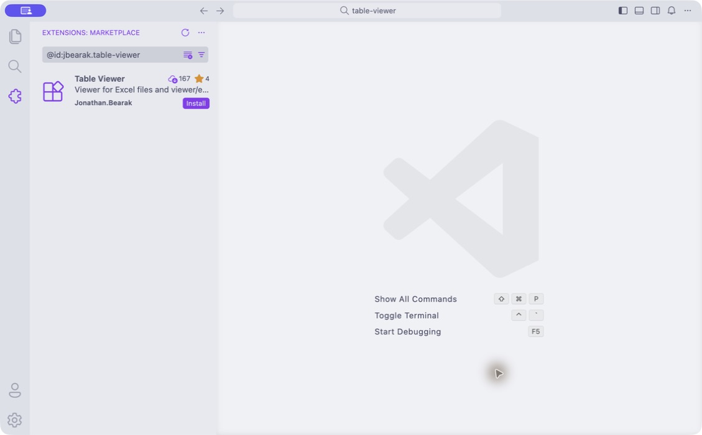
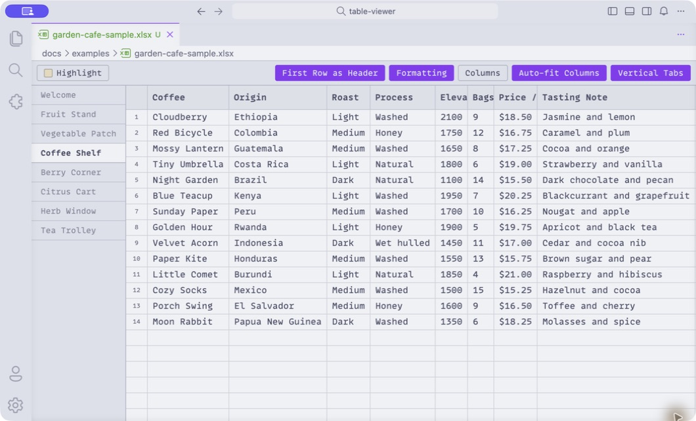
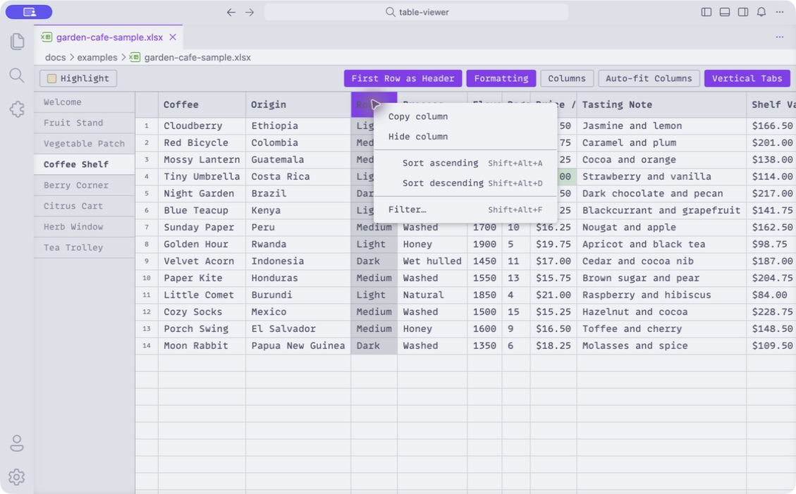
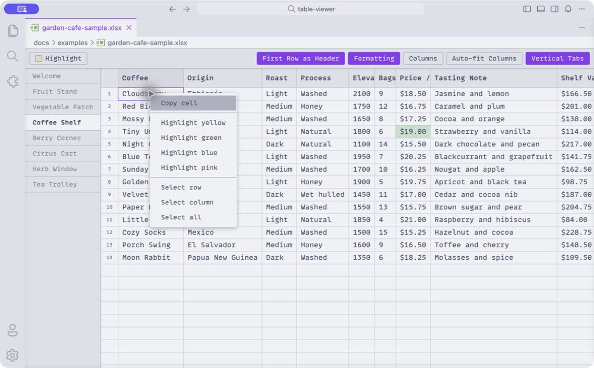
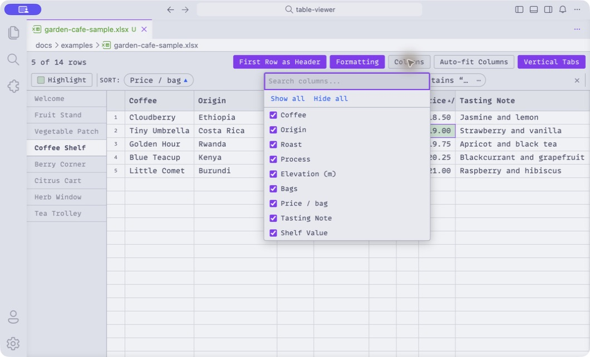

# Table Viewer setup and 10-minute try-out

Table Viewer opens Excel workbooks inside VS Code and remembers how you like to look at them. Sorting, filters, hidden columns, column widths, highlights, the active sheet, and other viewing choices are stored separately from the workbook. The Excel file itself is not changed.

You do not need to write code or already use VS Code. VS Code can simply be the app that hosts Table Viewer.

You can simply read through the guide—the screenshots show the main flow. If you would like to try it yourself, install Table Viewer and download these two small, cheerful workbooks so you can experiment without risking a real file:

- [Garden Café sample workbook](examples/garden-cafe-sample.xlsx)
- [Garden Café revised workbook](examples/garden-cafe-revised.xlsx)

The two files have the same set of sheets and columns, but the revised version changes quantities, prices, and some row positions. That makes them useful for testing whether your view survives a new delivery.

## 1. Install VS Code, if needed

If VS Code is not already installed, [download Visual Studio Code](https://code.visualstudio.com/) and follow its normal installation steps. Table Viewer requires VS Code 1.114 or later. You do not need to create a project, open a programming folder, or configure anything else.

## 2. Install Table Viewer

The Marketplace is the simplest option:

1. Open the [Table Viewer Marketplace page](https://marketplace.visualstudio.com/items?itemName=jbearak.table-viewer) and click **Install**. Approve the browser prompt to open VS Code if one appears.
2. Alternatively, open the **Extensions** view in VS Code by clicking the blocks icon on the left, or press `Cmd+Shift+X` on macOS / `Ctrl+Shift+X` on Windows or Linux. Search for `@id:jbearak.table-viewer` (the extension's exact ID), confirm that the result is published by **Jonathan.Bearak**, and click **Install**.
3. If VS Code offers a **Reload** or **Restart Extensions** button, click it.

The screenshot below shows the exact-ID search in VS Code, which returns only Table Viewer.

Installing a downloaded extension is equally fine. Open the [latest Table Viewer release](https://github.com/jbearak/table-viewer/releases/latest), download the `table-viewer-…vsix` file, then open the **…** menu at the top of the Extensions view and choose **Install from VSIX…**. Select the downloaded file and click **Install**.

## 3. Open the sample workbook

Download the [sample workbook](examples/garden-cafe-sample.xlsx), then open it from VS Code with **File → Open File…**. Excel files should open in Table Viewer automatically.

> [!NOTE]
> Table Viewer registers itself as VS Code's default editor for Excel files, so normally there is nothing to configure. If another Excel viewer is installed, VS Code may ask which editor to use; choose **Table Viewer**. To switch an already-open file, right-click its tab and choose **Reopen Editor With… → Table Viewer**. To change the default later, choose **Configure Default Editor** from that same editor picker.

The workbook has a welcome sheet followed by fruit, vegetable, coffee, berry, citrus, herb, and tea sheets. Click **Coffee Shelf** to get oriented.

## 4. Try the main viewing tools

Nothing in this section edits the `.xlsx` file, so feel free to poke around.

1. Click **Vertical Tabs** to move the worksheet tabs between the top and left side. With this many sheets, the left side is usually easier to scan.
2. Click **Auto-fit Columns**, or drag a column border. Double-clicking a column border fits that column to its contents.
3. Right-click a column header to sort or filter it. On **Coffee Shelf**, try filtering **Roast** to values containing `Light`, then sort **Price / bag** ascending.
4. Open **Columns** to hide fields you do not need. Try hiding **Origin**; open the menu again to bring it back.
5. Select one or more cells, open **Highlight**, choose a color, and click **Apply to selection**.
6. Click **Formatting** to switch between the workbook's formatted display values and the underlying raw values.

Right-clicking a column header is the quickest way to find its sort, filter, copy, and hide actions.

Active sorts and filters appear as controls above the table, where you can edit, disable, reverse, reorder, or remove them.

> [!TIP]
> Most common actions are available in more than one place:
>
> - To highlight quickly, right-click a cell—or right-click anywhere inside a multi-cell selection—and choose **Highlight yellow**, **Highlight green**, **Highlight blue**, or **Highlight pink**.
> - To hide a column without opening **Columns**, right-click its header and choose **Hide column**.
> - To give several adjacent columns the same width, click one column header, then hold **Shift** and click another. Every column between them is selected, inclusive. Drag a border on any selected column to resize them together.

## 5. See the persistence behavior

This is the part Table Viewer is chiefly meant to make less annoying.

1. Make a copy of `garden-cafe-sample.xlsx` and name the copy `garden-cafe-working.xlsx`.
2. Open `garden-cafe-working.xlsx` in Table Viewer.
3. On **Coffee Shelf**, resize a column, hide **Origin**, keep the light-roast filter, select a different sheet-tab arrangement, and highlight a cell.
4. Leave the workbook open in VS Code.
5. Make a copy of [the revised workbook](examples/garden-cafe-revised.xlsx), rename that copy to `garden-cafe-working.xlsx`, and use it to replace the existing working file in the same folder.

Table Viewer should refresh automatically. The data will change, while your compatible viewing choices remain in place. The important detail is that the revised workbook replaces the file at the same path; opening it under a different filename creates a separate saved view.

You can repeat the replacement while keeping the file open—handy when a script in R, Stata, or Python regenerates the same output file.

## 6. A few useful details

- Excel workbooks are read-only in Table Viewer. The extension does not write your sorts, filters, widths, hidden columns, or highlights into them.
- View choices are remembered per file and worksheet in VS Code's local extension storage.
- Sorts and filters follow column names, so Table Viewer may discard them if a revised workbook no longer has a compatible column structure.
- Highlights are positional annotations. They will reappear when temporarily missing rows, columns, or worksheets return, so you do not lose that time and effort.
- CSV and TSV files can also be opened as tables; unlike Excel workbooks, they have an optional edit mode.

## Troubleshooting

**The workbook opens in a different extension.** Right-click the editor tab and choose **Reopen Editor With… → Table Viewer**. You can make it the default for Excel files from the same menu.

**The extension does not appear after installation.** Open the Command Palette with `Cmd+Shift+P` / `Ctrl+Shift+P`, run **Developer: Reload Window**, and try the workbook again.

**The revised data appears as a separate view.** Check that it replaced the working file at exactly the same folder and filename. Saved views are tied to the file path.

**You want to remove Table Viewer.** Open Extensions, find **Table Viewer**, open its gear menu, and choose **Uninstall**. Removing the extension does not affect any workbook.

## What feedback would be most helpful?

Honest first impressions are ideal. In particular:

- Was installation or opening the first workbook confusing anywhere?
- Which control did you reach for first, and was it where you expected?
- Did the revised-file exercise preserve what you expected it to preserve?
- Did sorting, filtering, column hiding, highlighting, or sheet navigation feel slower or stranger than Excel?
- What would keep you from using this on a real workbook?

There are no wrong answers—rough edges and “I expected it to…” reactions are especially useful.
